# Slack
 
Lone Conservative is a community. As a community we use [Slack](slack.com) as our mode of communication. Whether it would be company wide announcments or general conversation, it is the hallmark of our community tradition.

## Our Rules

As laid out in [here](personal-conduct.md#our-slack-channel):

Access to the Lone Conservative Slack channel is a privilege, not a right. If you choose to abuse your privileges they will be taken away.

Please use the #announcements channel for important announcements and business-related questions only. The #random channel is an open free-for-all. Please use the #article-topics channel to pitch and discuss ideas for topics.

Harassment of individuals, either publicly in a channel, or via direct message, will not be tolerated in any form.

## How to Join

After reading and agreeing to the [contributor-contract](contributor-contract.md), in addition to having your article posted, you will be sent an invitation to Slack.

### Here are the steps to join.

1. Open email invitation. This will be sent to the email you sent your application with.
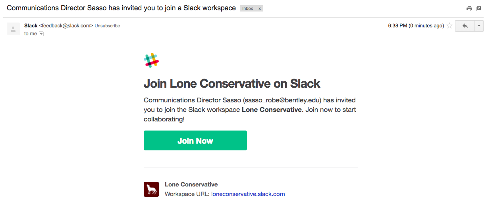

2. Type in your real name and create a strong password.
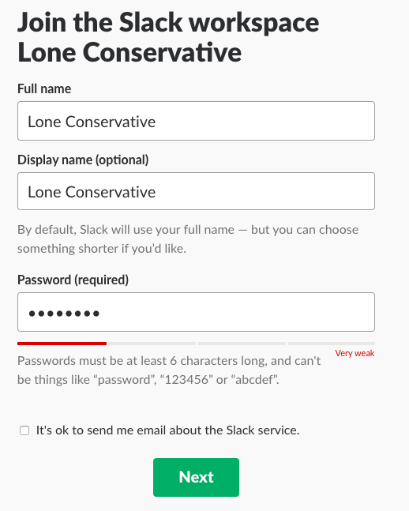

3. Read and agree to terms of service.
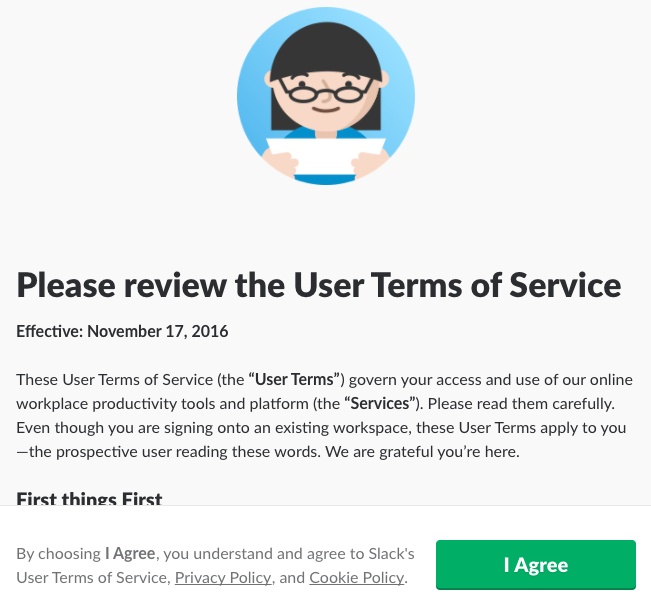

After you join you are required to stay in #announcements and #article-topics. Additionally, you will be added to #random. Also, read the description of the rest of the channels, which are optional, to see where you can use your talents to help Lone Conservative.

If you are joining as an editor, or would like to become one, DM Elizabeth Desimone.

## #announcements

This is our most important channel. In this channel there will be company-wide announcements. This can range from projects we are starting, sharing links to major new organizations that mention our articles, posting our links to our weekly meetings, and much more. If you wish to be less active in slack, it is fine, however, keep up-to-date with this channel to ensure you are not falling behind.

As previously mentioned, we have weeking meetings on Google Hangout. One at 7 PM ET and the other at 10 PM ET on Sunday. During these we recap our social media growth, discuss internship openings, political trainings, and various other opportunities. Additionally, during these meetings we set policy in regards to articles and slack, making these meetings important to attend if you wish to remain informed on all things Lone Conservative. This is a great time to meet the rest of the contributors and get integrated to our community. Additionally, if you want to voice your opinion, ask the executive board a question, or just pitch an idea, this is the time to do it.

## #article-topics

This is the channel you need to access to pitch article ideas. The guidelines to article pitches is laid out [here](article-guidelines.md#article-guidelines). This channel is used to get an approval of topics, whether it be from Kassy, Alec, or Rob. When thinking about a topic, remember to ensure they meet the article guidelines linked above.

Ideas can be based off current events, reactions to crazy pieces in the MSM, college news pieces, and many more ideas. Make sure if you have an idea, be able to answer: what about this piece will be unique? This will be the first question you are asked. Be able to answer it to get your idea approved.

For news piece, these can focus on stuff that happens around your campus that shows extreme leftist craziness or anything else  that may be politically relevant. Let the channel know so we can cover this in a timely manner. We pride ourselves on our coverage as highlighted by our success during the lead up to Ben Shapiro's Berkeley lecture.

### Trello

Once your article is approved it goes to Trello. For those who are new, Trello is the website we use to categorize our article ideas. Additionally, if you ever feeling the need to write an article, but can't think of a topic, Trello has a list of topics we have pre-approved for submission and review.

#### How to set up Trello account.

1. To being, click this [link](https://trello.com/invite/loneconservative/25ccd24c43e8f5324739576b1cdae577).

2. Click Sign up link.
 

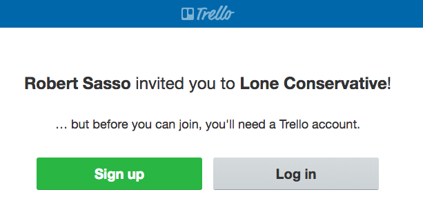

3. Complete the Trello account set up.
 

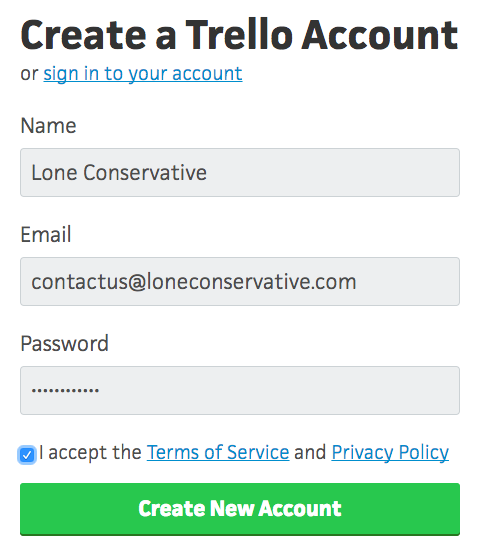

4. Go to email to verify your account.
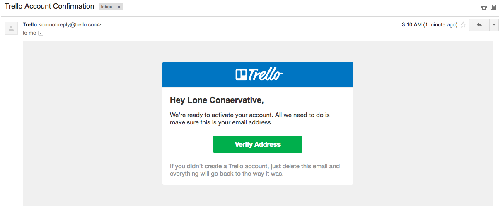

#### How to set up Trello on Slack.

1. In #article-topics, type "/trello add" and click "Link Account".
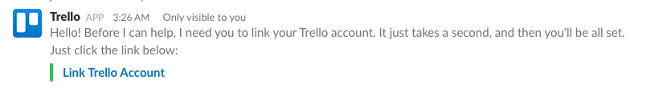

2. After being redirected to Trello, click "Allow".
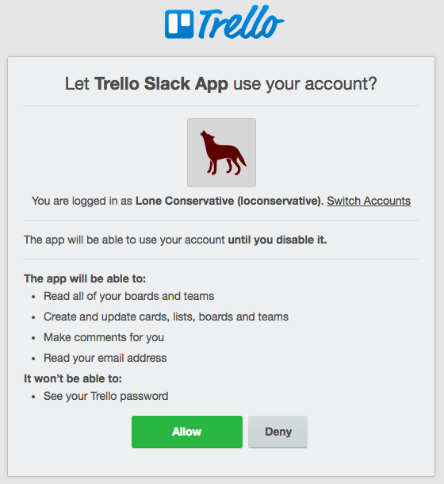

3. Once you return to slack, to add your article type "/trello add article name"
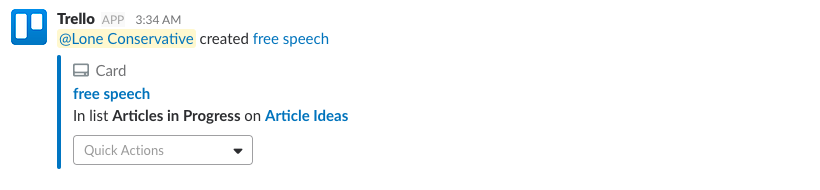

4.
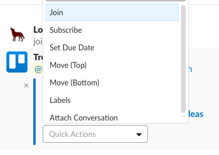

5.
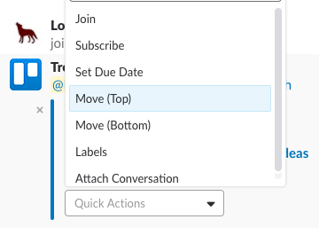

6.
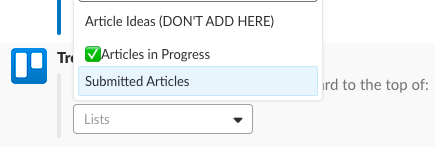

## #merchandise

## #on-the-line

## #random

## #social-media

## #tech

